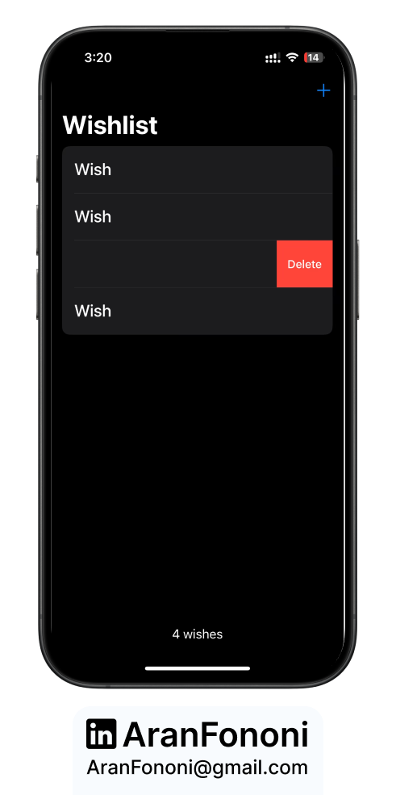

# Wish List 🎯❤️  

### Learning SwiftData & SwiftUI  

This is my latest project from the **SwiftUI Masterclass**, where I built a **Wishlist app** to explore **SwiftData** for data persistence in SwiftUI. 🚀  

## 📌 Project Overview  
This app allows users to **create, save, and manage a wishlist** with a smooth and simple UI. The goal was to get hands-on experience with **SwiftData**, leveraging its features for efficient data handling.  

## 🚀 What I Focused On  
- **SwiftData:** Used `@Model`, `@Query`, and `@Environment(\.modelContext)` to manage data persistence.  
- **SwiftUI:** Built a clean, responsive UI with **dynamic lists, toolbars, and swipe actions**.  
- **Alerts & Overlays:** Implemented an intuitive way to add new wishes with `Alert` and `ContentUnavailableView`.  
- **Optimized User Experience:** Added **dynamic wish count tracking** and an empty state placeholder.  

## 🔥 Features  
✅ **Create & save wishes** with SwiftData  
✅ **Swipe-to-delete** functionality  
✅ **Dynamic wish count** in the toolbar  
✅ **Empty state UI** when no wishes exist  
✅ **Live preview support** for better development  

---

## 📸 Screenshot  
  

---

## 🛠️ How to Use  
1. Clone this repository.  
2. Open the project in **Xcode (iOS 17+ recommended)**.  
3. Run the app on a **simulator or a real device**.  
4. Add, delete, and manage your wishlist!  

---

## 📬 Contact  
For any feedback or collaboration, feel free to reach out:  
- **Email**: [aranfononi@gmail.com](mailto:aranfononi@gmail.com)  
- **LinkedIn**: [Aran Fononi](https://www.linkedin.com/in/aran-fononi-18182b265)  
